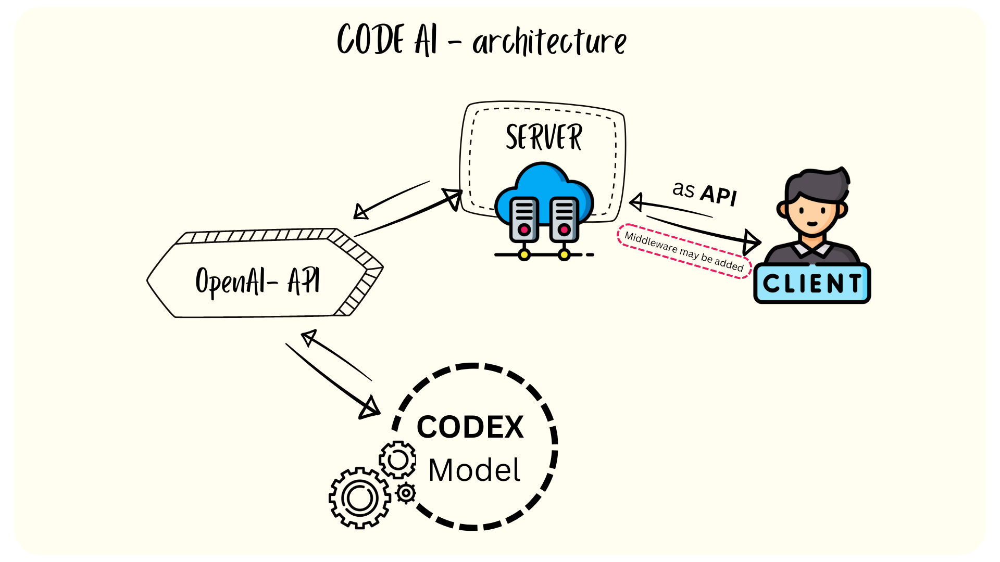

# CodeAI

CodeAI is a tool for automatically generating code from natural language specifications. 

### Description 
- Web app that helps to write code with the help of ai . 
- Just send a promp or request and get block of code in respose. 

## Architecture


## Key Features 
- Explain a piece of code. what it does !! 
- Genrate **SQL** Query code from user input *(natural language)*.
- Generate Javascript/Typescript code from user input *(natural language).* 
- Calculate time complexity of a given function by user.
- Translate from one programming language to another.


## Installation

Rename .env.example to .env and add your openai api key there.

```bash
    npm install
    # or
    yarn install
```
## Running
    
 ```bash 
    npm run dev
    # or
    yarn dev
```


Open [http://localhost:3000](http://localhost:3000) with your browser to see the result.
