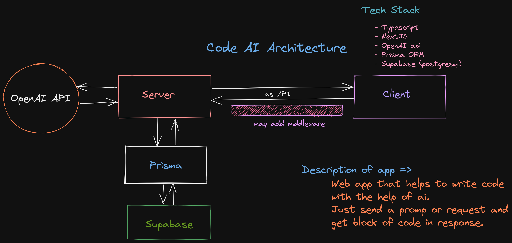

# CodeAI

CodeAI is a tool for automatically generating code from natural language specifications. 

## Architecture

## Installation

Rename .env.example to .env and add your openai api key there.

```bash
    npm install
    # or
    yarn install
```
## Running
    
 ```bash 
    npm run dev
    # or
    yarn dev
```


Open [http://localhost:3000](http://localhost:3000) with your browser to see the result.
